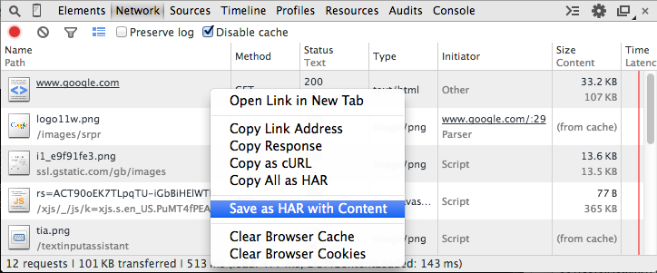
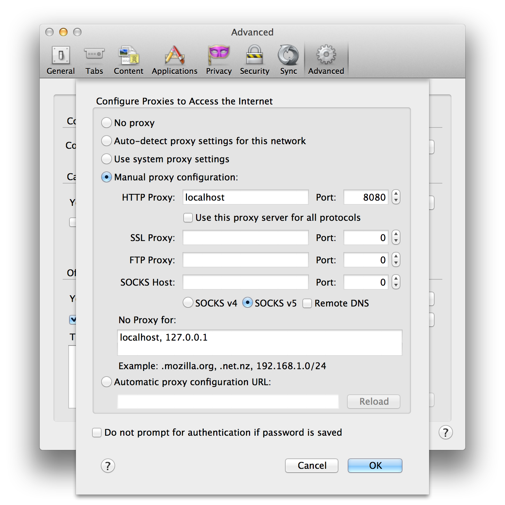

harmonica
=========

:warning: Still in earlish development. Not quite user-friendly yet :warning:

Replay server responses from a HAR file.

Useful if…

* …you want to develop offline and your development server isn't local
* …your development server is very slow and you want to go faster
* …you are developing against an API with rate limits

## Running

You need to have a `.har` file, run Harmonica, and then set up your browser to use it as a proxy.

A `.harmonica.json` in the current directory is used by default if no config option is given.

```
harmonica [options] <.har file>

Options:
  -c, --config  The config file to use
  -p, --port    The port to run the proxy server on  [default: 8080]
  -d, --debug   Turn on debug logging
```

See the [Setup section for details on creating `.har` file and using the proxy in your browser](#setup).

## Configuration

The config file is a JSON file (plus `//` comments) with the following properties:

* `version` – currently `1`
* `mappings` – Maps from URLs to file system paths. It is an array of `{match, path}` objects. `match` is a string or regex, and `path` is a string. `path` can contain `$n` references to substitute capture groups from `match`.
* `replacements` – Replaces strings in the body of textual content. It is array of `{match, replacement}` objects. `match` is a string, regex or variable, and `replacement` is a string or variable. `replacement` can contain `$n` references to substitute capture groups from `match`.

Full example:

```json
{
    "version": 1,
    "mappings": [
        {
            "match": {"regex": ".*\\/static\\/(.*)"},
            "path": "./public/$1"
        }
    ],
    "replacements": [
        // For JSONP requests where callback name is randomly generated
        {
            "match": {"var": "entry.request.parsedUrl.query.callback"},
            "replace": {"var": "request.parsedUrl.query.callback"}
        },
        // Proxy only works over http
        {"match": "https", "replace": "http"}
    ]
}
```

### Types

The types mentioned above take the following forms:

* `string` – a plain string. Example: `"something"`.
* `regex` – an object with a `regex` property, and an optional `flags` property. If you don't provide the `flags` property, unlike JavaScript, the regex has the global flag set. Example: `{"regex": "user\\/([a-z]+)", "flags": "ig"}`
* `variable` – an object with a `var` property which contains a path to a value. See below for the available variables. Example: `{"var": "request.parsedUrl.query.q"}` 

### Variables

* `request` – the [Node request object](http://nodejs.org/api/http.html#http_http_incomingmessage) with the addition of a `parsedUrl` property, containing the [parsed url](http://nodejs.org/api/url.html) and `query`.
* `entry` – the [HAR entry](http://www.softwareishard.com/blog/har-12-spec/#entries) that is being used to respond to this request. It also has a `parsedUrl` property, and an `indexedHeaders` property which maps each header name to it's value(s).

## Setup

### Getting a `.har` file

The easiest way is with the Chrome DevTools. In the Network panel disable the cache, refresh the page and interact with the page to generate the network requests that you want to capture. Then right click and select "Save as HAR with Content".



**Note:** Extensions such as AdBlock and Ghostery interfere with the recorded responses. Be aware of this and, if necessary, disable them before loading the page.

### Browser proxy configuration

#### Chrome

Launch with the `--proxy-server` argument:

```
/Applications/Google\ Chrome.app/Contents/MacOS/Google\ Chrome --proxy-server=127.0.0.1:8080
```

#### Firefox

Preferences > Advanced > Network > Settings… > Manual proxy configuration



## License

TBD. Currently proprietary.
